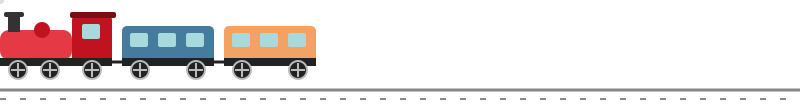

<div align="center">



<a href="https://github.com/rupaktajpuriya29-lab">
  
</a>

</div>

# Xt_tan 🐈‍⬛

`student • creator • builder • perpetual learner`

I don't just want to use technology. I want to understand how it works.

I'm a 9th-grade student exploring the intersection of programming, Linux, cybersecurity, creativity, and music.

I'm building my foundations in programming while going deeper into the systems underneath it all. At the same time, I'm exploring creative tools and turning some of my artwork into real-world projects.

<div align="center">
  
</div>

## 🧠 Currently Learning

```
Programming        → Python
Version Control    → Git / GitHub
Systems            → Linux
Security           → Cybersecurity fundamentals
Creative Tech      → Blender / DaVinci Resolve
Audio              → Music production
```

I'm especially interested in Linux, system architecture, cybersecurity, automation, and understanding what happens under the hood.

## 🛠️ Things I'm Building

* 🐍 Python projects & experiments
* 🐧 Linux environments and configurations
* 🔐 Cybersecurity learning projects
* 🎨 Traditional & digital artwork
* 🧊 3D experiments
* 🎬 Video projects
* 🎵 Music & audio experiments

A lot of what you'll find here will be experiments, learning projects, unfinished ideas, and things I built simply because I wanted to know:

**"What happens if I do this?"**

## 🎨 Beyond Code

When I'm not programming, I'm probably:

🎨 Drawing or painting 🎤 Singing 🎸 Learning guitar 🎧 Exploring music 📚 Studying 🧠 Thinking about another project

I like having both sides — technical and creative.

## 🚀 The Long Game

I'm still at the beginning.

Right now, I'm focused on building skills, projects, knowledge, and experience rather than pretending I already know everything.

The goal?

**Become extremely capable.**

```
Learn
  ↓
Build
  ↓
Break
  ↓
Understand
  ↓
Rebuild
  ↓
Repeat
```

## 📂 What You'll Find Here

```
learning projects
experiments
random ideas
automation
Linux configurations
Python
creative projects
and things I haven't thought of yet
```

If something here looks unfinished...
it probably is.

That's kind of the point. :3

## 🔗 My Projects

I'll be adding my project links here, so if you ever wanna check them out just click the link!

* 🌐 Portfolio - https://rupaktajpuriya29-lab.github.io/My-first-ever-portfolio./
* 🐍 Wild Snake - https://rupaktajpuriya29-lab.github.io/Wild-Snake/

<div align="center">
  
</div>

## 🌌 `BUILDING IN PUBLIC`

9th grade → learning → experimenting → building → becoming

The repository is only the beginning.

<div align="center">
  
</div>
