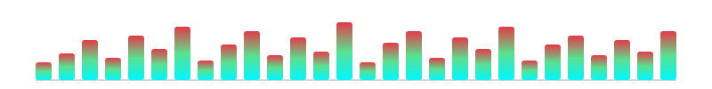

<div align="center">



<a href="https://github.com/rupaktajpuriya29-lab">
  
</a>

</div>

# Xt_tan 🐈‍⬛

`student • creator • builder • perpetual learner`

I don't just want to use technology.  
I want to understand **how it works**.

I'm a 9th-grade student exploring the intersection of **programming**, **Linux**, **cybersecurity**, **creativity**, and **music**.

I'm building my foundations in programming while going deeper into the systems underneath it all. At the same time, I'm exploring creative tools and turning some of my artwork into real-world projects.

<div align="center">
  
</div>

## 🧠 Currently Learning

```text
Programming        →  Python
Version Control    →  Git / GitHub
Systems            →  Linux
Security           →  Cybersecurity fundamentals
Creative Tech      →  Blender / DaVinci Resolve
Audio              →  Music production
```

I'm especially interested in Linux, system architecture, cybersecurity, automation, and understanding what happens under the hood.

## 🛠️ Things I'm Building

- 🐍 **Python projects & experiments**
- 🐧 **Linux environments and configurations**
- 🔐 **Cybersecurity learning projects**
- 🎨 **Traditional & digital artwork**
- 🧊 **3D experiments**
- 🎬 **Video projects**
- 🎵 **Music & audio experiments**

A lot of what you'll find here will be experiments, learning projects, unfinished ideas, and things I built simply because I wanted to know:

> **"What happens if I do this?"**

## 🎨 Beyond Code — Hobbies

When I'm not programming, I'm usually somewhere on this list:

<table>
  <tr>
    <td width="50%">
      <h3>🎨 Drawing & Painting</h3>
      Traditional sketches, digital art, and turning random ideas into visuals.  
      I like the process as much as the final piece.
    </td>
    <td width="50%">
      <h3>🎤 Singing</h3>
      Just for the joy of it.  
      Exploring different styles and trying to get better every time I open my mouth.
    </td>
  </tr>
  <tr>
    <td width="50%">
      <h3>🎸 Learning Guitar</h3>
      Slowly building muscle memory and theory.  
      Still a beginner, but the progress feels real.
    </td>
    <td width="50%">
      <h3>🎧 Music Exploration</h3>
      Listening widely, analyzing tracks, and sometimes producing my own little experiments.
    </td>
  </tr>
  <tr>
    <td width="50%">
      <h3>📚 Studying</h3>
      School + self-learning.  
      Trying to connect what I learn in class with what I build outside it.
    </td>
    <td width="50%">
      <h3>🧠 Project Thinking</h3>
      Constantly running new ideas in the background.  
      Half of them never get built… the other half become the next experiment.
    </td>
  </tr>
</table>

I like having both sides — **technical** and **creative**.  
One feeds the other.

## 🚀 The Long Game

I'm still at the beginning.

Right now I'm focused on building skills, projects, knowledge, and experience rather than pretending I already know everything.

**The goal?**

**Become extremely capable.**

```text
Learn
  ↓
Build
  ↓
Break
  ↓
Understand
  ↓
Rebuild
  ↓
Repeat
```

## 📂 What You'll Find Here

```text
learning projects
experiments
random ideas
automation
Linux configurations
Python
creative projects
and things I haven't thought of yet
```

If something here looks unfinished…  
it probably is.

That's kind of the point. :3

## 🔗 My Projects

I'll keep adding project links here. Click any of them if you want to check them out:

| Project | Link |
|---------|------|
| 🌐 Portfolio | [My first ever portfolio](https://rupaktajpuriya29-lab.github.io/My-first-ever-portfolio./) |
| 🐍 Wild Snake | [Wild Snake game](https://rupaktajpuriya29-lab.github.io/Wild-Snake/) |

<div align="center">
  
</div>

## 🌌 `BUILDING IN PUBLIC`

```text
9th grade → learning → experimenting → building → becoming
```

The repository is only the beginning.

<div align="center">
  
</div>
